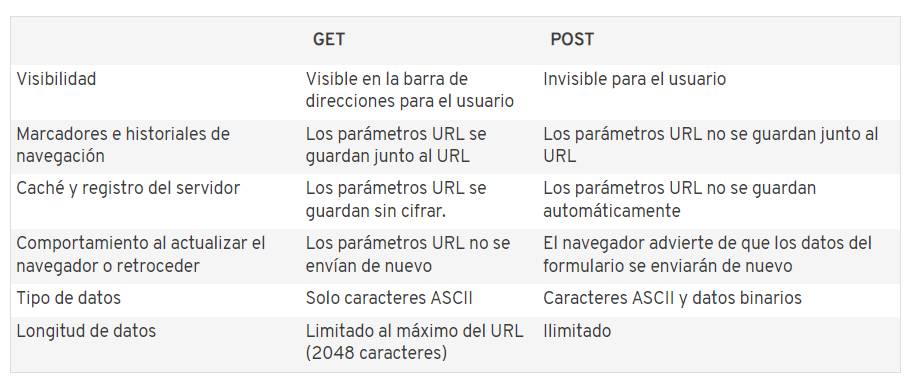
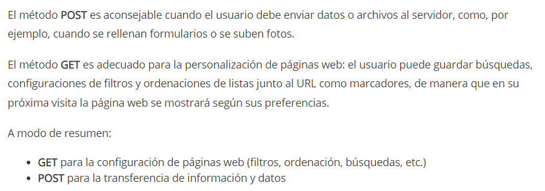

# Full-Stack-JavaScript-Developer-Curso
Con el método GET, los datos que se envían al servidor se escriben en la misma dirección URL. En la ventana del navegador, lo encontrarás así:
www.ejemplo.com/registrarse.php?nombre=pedro&amp;apellido=perez&amp;edad=55&amp;genero=hombre

Toda la información introducida por el usuario (los llamados “parámetros URL”) se transmiten tan abiertamente como el URL en sí mismo. Esto tiene ventajas y desventajas.
Como ventaja Los parámetros URL se pueden guardar junto a la dirección URL como marcador. y como desventaja es su débilprotección de los datos. 

El método POST introduce los parámetros en la solicitud HTTP para el servidor. Por ello, no quedan visibles para el usuario. Además, la capacidad del método POST es ilimitada.
Ventaja
En lo relativo a los datos, como, por ejemplo, al rellenar formularios con nombres de usuario y contraseñas, el método POST ofrece mucha discreción.
Desventaja
Cuando una página web que contiene un formulario se actualiza (por ejemplo, cuando se retrocede a la página anterior) los datos del formulario deben transferirse de nuevo (puede que alguna vez hayas recibido una de estas advertencias). Por este motivo, existe el riesgo de que los datos se envíen varias veces por error, lo que, en el caso de una tienda online, puede dar lugar a pedidos duplicados.Además, los datos transferidos con el método POST no pueden guardarsejunto al URL como marcador.

¿Cuándo usar uno u otro?

